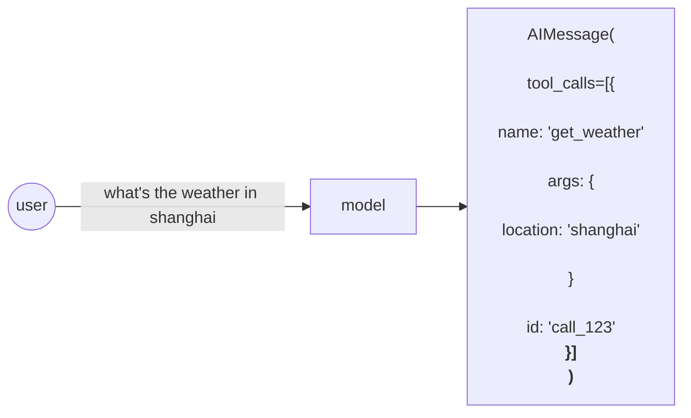

```mermaid
flowchart LR
    s1((user))
    s2["model"]
    s3["AIMessage(<br>
        tool_calls=[{<br>
            name: 'get_weather'<br>
            args: {<br>
                location: 'shanghai'<br>
            }<br>
            id: 'call_123'<b>
        }]
    )"]

    s1 -->|what's the weather in shanghai| s2 --> s3
```